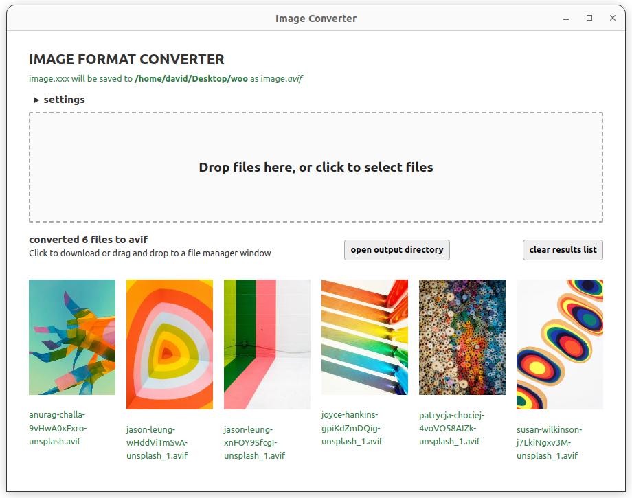
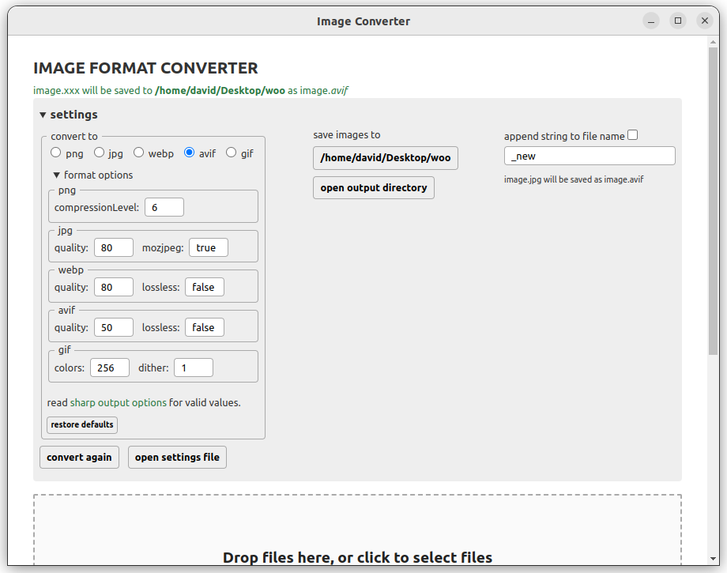

# image-converter2

NOTE: Work in progress. There may be security vulnerabilities.

Image format conversion app.  
An Electron app built with created with [electron-vite](https://electron-vite.org/), [svelte](https://svelte.dev) and [sharp](https://sharp.pixelplumbing.com)  

  
  

## Install  

```bash
$ npm install
```

## Development  

```bash
$ npm run dev
```

## Build

```bash
# For windows
$ npm run build:win

# For macOS
$ npm run build:mac

# For Linux
$ npm run build:linux
```
