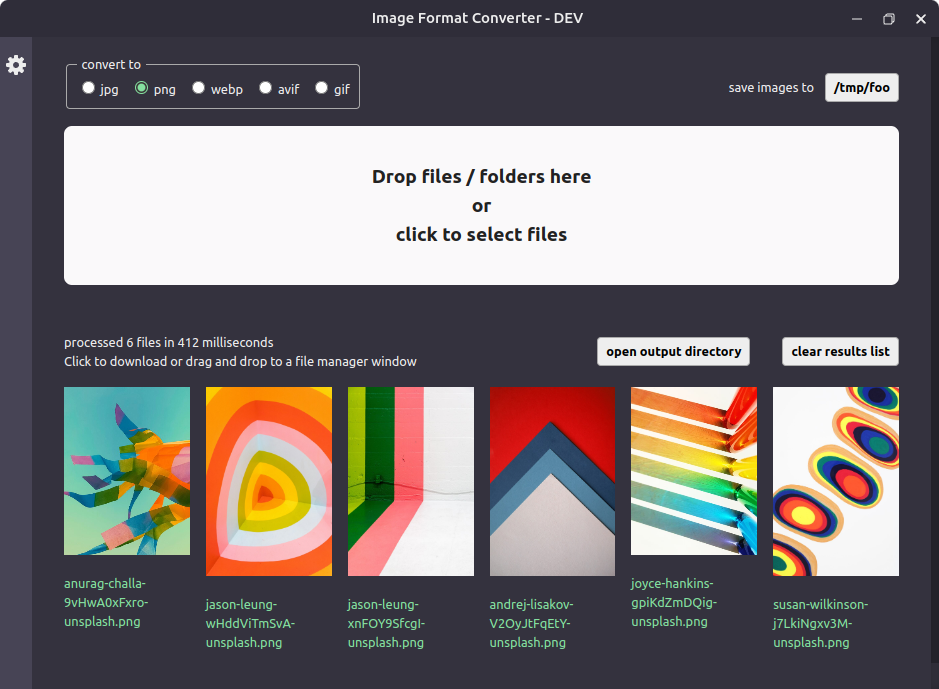
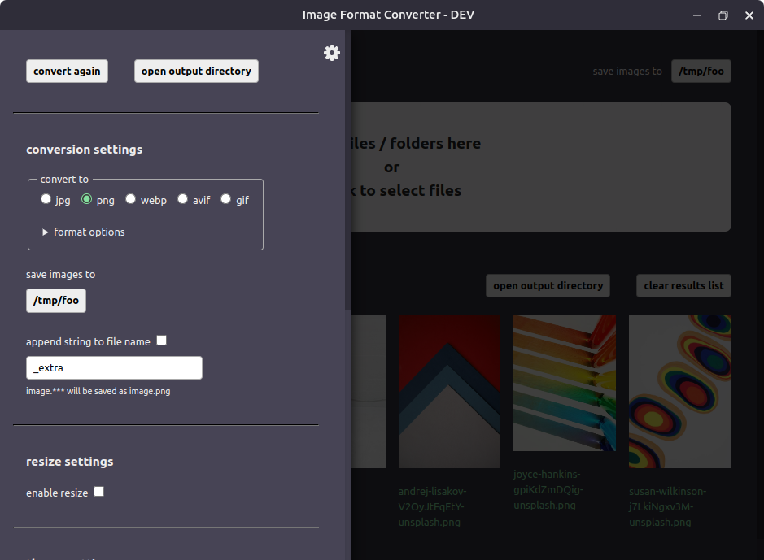

# image-converter2

Batch image format conversion app built with Electron, electron-vite, sharp, and svelte.  
Work in progress.  
Only tested on linux.
Conversion from heic is slow.

## Install  

```bash
$ npm install
```

## Development  

```bash
$ npm run dev
```

## Build

```bash
# For Linux
$ npm run build:linux
```

### note  
If the app crashes when converting many or large images. Try setting G_SLICE to malloc-always in terminal before running the app.  


```bash
  export G_SLICE=always-malloc
```

## Screenshots
  
  
  