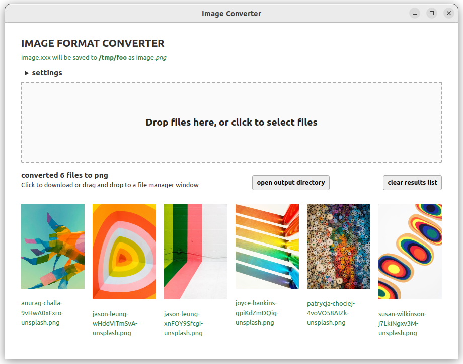
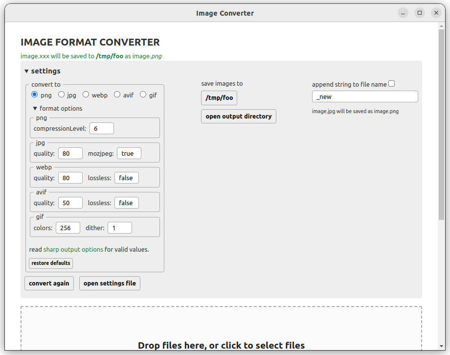

# image-converter2

Batch image format conversion app.  
Work in progress.  

## Install  

```bash
$ npm install
```

## Development  

```bash
$ npm run dev
```

## Build

```bash
# For windows
$ npm run build:win

# For macOS
$ npm run build:mac

# For Linux
$ npm run build:linux
```

## Credits
built with:  
[electron-vite](https://electron-vite.org/)  
[svelte](https://svelte.dev)  
[sharp](https://sharp.pixelplumbing.com)  
[electron-store](https://github.com/sindresorhus/electron-store)  
[svelte-file-dropzone](https://github.com/thecodejack/svelte-file-dropzone)  
app icon: [svgrepo](https://www.svgrepo.com/svg/230976/picture-image)  


## Screenshots
  
  